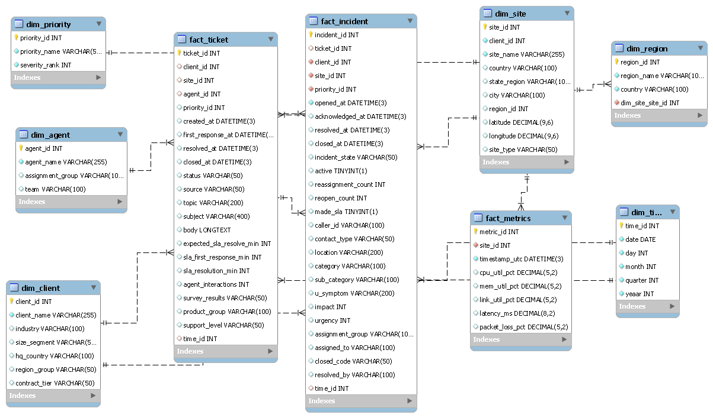
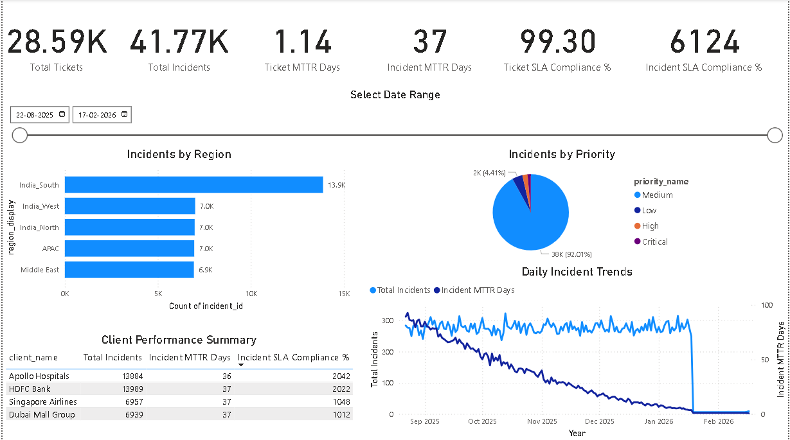
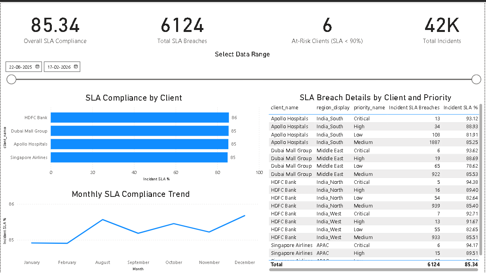
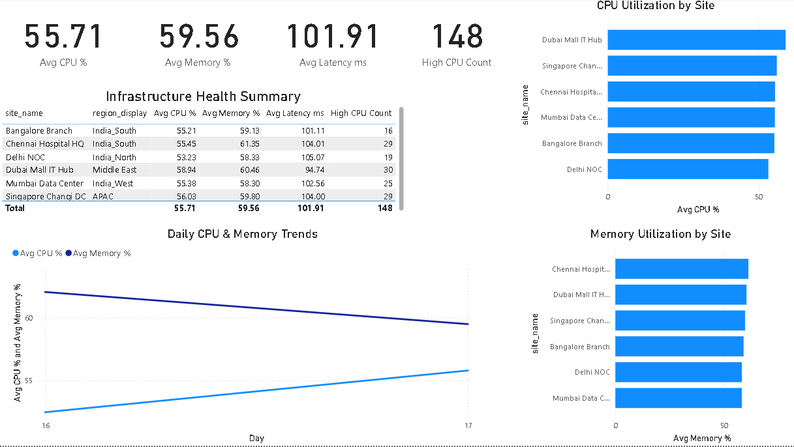

# Multi-Region IT Infrastructure Service Performance & SLA Analytics

## Project Overview
This project implements a complete data analytics platform for IT infrastructure providers managing services across India and international locations. It integrates data from multiple sources into a centralized data warehouse, automates ETL processing, and provides interactive Power BI dashboards for service monitoring and SLA tracking.

## Key Features
- **Data Warehouse**: Star schema design with 5 dimension tables and 3 fact tables
- **ETL Pipeline**: Python-based automation for data extraction, cleaning, and loading
- **4 Power BI Dashboards**: Operations, SLA & Customer Health, Capacity & Utilization, Executive Summary
- **Data Quality**: 95%+ data quality score with comprehensive validation

## Data Volume
- Tickets: 28,587 records
- Incidents: 41,769 records
- Metrics: 84,000 records
- Total: 1.5+ lakh records processed

## Key Insights
- India_South region accounts for 33% of total incidents (13,884 incidents)
- Overall SLA compliance: 85.3% with 6,124 breaches
- Estimated penalty exposure: $6.1 million
- Critical incidents take 34 days vs 4-hour SLA target

## Technologies Used
| Category | Technologies |
|----------|--------------|
| Database | Microsoft SQL Server, T-SQL |
| ETL | Python, Pandas, NumPy, pyODBC |
| BI & Visualization | Power BI, DAX |
| Data Modeling | Star Schema, Dimensional Modeling |

## Database Schema (ERD)

## Power BI Dashboards

### Operations Dashboard

### SLA & Customer Health Dashboard

### Capacity & Utilization Dashboard

